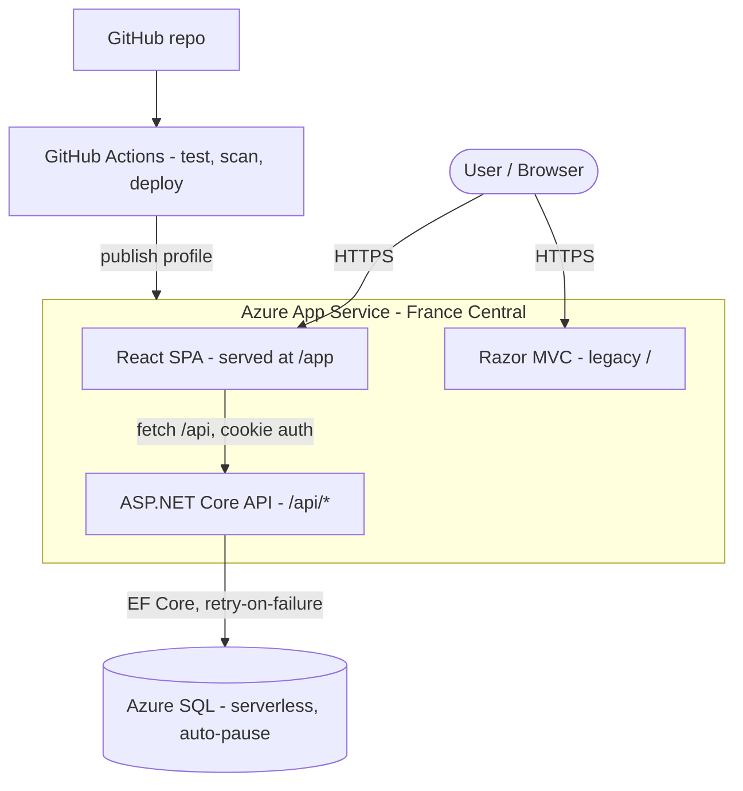
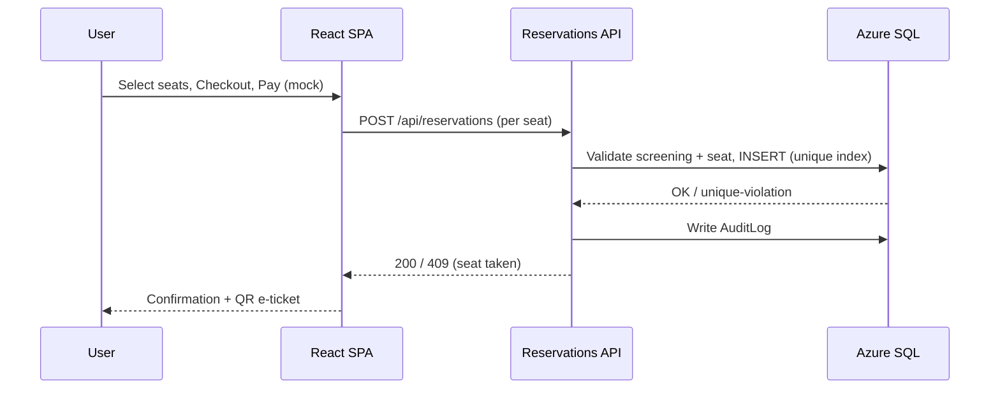

# Architecture

adafcinema is a full-stack cinema booking system: an ASP.NET Core (.NET 10) backend
serving a React SPA, backed by Azure SQL, deployed to Azure App Service via GitHub Actions.

## System diagram

## Request flow (booking)

## Key components

| Layer | Tech | Notes |
|-------|------|-------|
| Frontend | React 18 + TS, Vite, Bootstrap, custom CSS | Bundled locally (offline-safe); i18n EN/PL/RU |
| API | ASP.NET Core controllers under `Controllers/Api/` | Cookie auth, `[Authorize]`, rate limiting, output cache |
| Auth | ASP.NET Identity | Roles: Admin / User; lockout after 5 failed attempts |
| Data | EF Core 10 + Azure SQL | Migrations applied on startup; `EnableRetryOnFailure` |
| Audit | `AuditLog` table + `IAuditService` | Append-only record of security-relevant actions |
| CI/CD | GitHub Actions | Test + dependency scan gate, then publish-profile deploy |

## Cross-cutting

- **Concurrency:** unique index on `(ScreeningId, SeatId)` prevents double-booking;
  `RowVersion` optimistic concurrency on users.
- **Caching:** output cache on the public screenings list, evicted by tag on changes.
- **Resilience:** EF transient-retry handles Azure SQL serverless wake-ups.
- **Secrets:** connection string in Azure App Service config, never in source.
